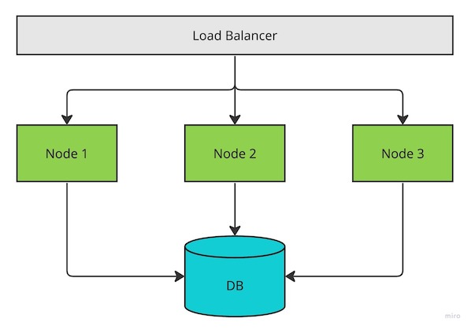

# Introduction
TODO

## The Problem
Consider a simple Service with three instances running behind a Load Balancer which needs to read/write from a DB like the one in diagram below. In this scenario, each of the nodes needs to interact with the DB to perform the retrievals and updates of data.

This is of course a naive implementation without optimizations but the goal here was just use this architecture as a starting point.

# Existing Approaches

## Near Cache

## Distributed Cache

# Near-Distributed Cache
