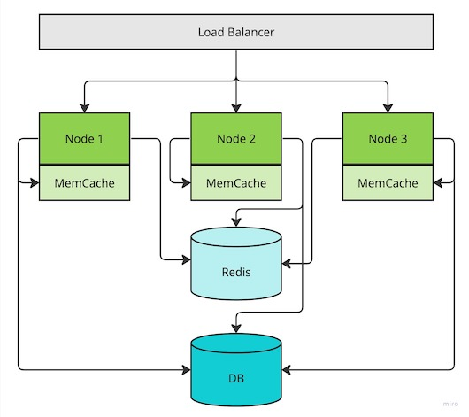

# Introduction
The tech world is full of microservices, some complex while others not so much but all share certain architectural patterns.
One of these patterns is the need of caching when dealing with data that needs to fetched/stored in databases in order to reduce response times and reduce network latencies.
The goal of this tutorial is to introduce the concept of Near-Distributed Cache using Hazelcast and how this framework can help us to address some of those issues.

## Scenario
Consider a simple Service with three instances running behind a Load Balancer which needs to read/write from a DB like the one in the diagram below.
In this scenario, each of the nodes needs to interact with the DB to perform the retrievals and updates of data.


This is of course a naive implementation without optimizations but the goal here was just use this architecture as a starting point.

## Measurements
For the purpose of evaluating the different approaches discussed in this article we will use a simple scenario where we attempt to fetch six times the same resource via the service load balancer (assuming a simple round-robin approach) and the following simple metrics:
* \# DB Queries: the number of queries that had to be executed in the DB in order to fetch the record
* \# Network Requests: the number of requests where each node had to use the network to retrieve the information needed

### Evaluation
This is the metrics baseline for simple architecture described above that will also be used as comparison to the other approaches:
* 6 DB Queries: each request had to perform a retrieval operation in the DB to fetch the record
* 6 Network Requests: each request to connect to the DB in order to fetch the record

# Existing Approaches
Before diving into the Near-Distributed Cache in general and Hazelcast in particular, lets look at some existing caching strategies.

## Near Cache
One of most common approaches to reduce the number of interactions with the DB is to use a Near Cache framework like for example MemCache.
In this scenario, an instance of MemCache is initialized in each node and the data lifecycle needs to managed in each node.  


### Evaluation
* 3 DB Queries: each node had to load the same record from the DB for the first three requests
* 3 Network Requests: each node had to load the same record from the DB for the first three requests, following three were served from cache

## Distributed Cache
Another common approach to optimize data retrieval applications is to use a distributed cache approach like Redis, which is a lot faster than fetching the data from the DB.
In this scenario, the first node that fetches the record is responsible for storing that data in Redis, which then becomes available for all other nodes.


### Evaluation
* 1 DB Queries: first node that received the request fetched the record from the DB and stored in Redis
* 7 Network Requests: one request to fetch the record from the DB, one more to store that record in Redis and five more requests to fetch the data from Redis on the following requests

## Near + Distributed Cache
A combination of both Near and Distributed Cache is a more complex but effective approach to take advantage from both techniques, where we will leverage the same stack as before, so MemCache as near cache and Redis as distributed cache.
In this scenario, the first node that fetches the record is responsible for storing that data in Redis, which then becomes available for all other nodes, and also storing that record in the local instance of MemCache. When requests reach other nodes, first the data will be retrieved from Redis and stored in MemCache for subsequent requests made on the same node. 



### Evaluation
* 1 DB Queries: first node that received the request fetched the record from the DB and stored in Redis
* 4 Network Requests: one request to fetch the record from the DB, one more to store that record in Redis and two more requests to fetch the data from Redis on the following requests from the other two nodes, then remaining three requested were served from near cache

# Near-Distributed Cache
As the diagram below highlights, the principle is similar to the Near + Distributed cache approach but the architecture is a lot less complex.
Hazelcast acts as both the Near and Distributed cache and the logic in the node just needs to handle the storage/retrieval in one of the nodes.
The framework is then responsible for the propagation of data across all other nodes, which is transparent process for the clients.


## Evaluation
* 1 DB Queries: first node that received the request fetched the record from the DB and stored in Hazelcast near cache
* 1+2 Network Requests: first node connected to the DB to fetch the record, plus two requests in the background for Hazelcast to propagate the cache to the other two nodes

# Usage
As a simple demo for this concept there is a basic Java implementation of a service using Hazelcast as Near-Distributed Cache.

## Cluster
In this sample, we are initializing three basic HTTP servers where each of them initializes an instance of Hazelcast in order to replicate the architecture mentioned above.
The code required to achieve this in Java is quite simple:

```java
final HttpServer httpServer = HttpServer.create(new InetSocketAddress("127.0.0.1", port), 0);
httpServer.start();
Hazelcast.newHazelcastInstance();
```

In addition, we also need to create a `hazelcast.xml` file in the application resources in order for the cluster to be able to run multiple Hazelcast members in the same machine:

```xml
<?xml version="1.0" encoding="UTF-8"?>
<hazelcast xsi:schemaLocation="http://www.hazelcast.com/schema/config hazelcast-config-3.10.xsd"
           xmlns="http://www.hazelcast.com/schema/config"
           xmlns:xsi="http://www.w3.org/2001/XMLSchema-instance">

    <network>
        <join>
            <multicast enabled="false"/>
            <tcp-ip enabled="true">
                <interface>127.0.0.1</interface>
            </tcp-ip>
        </join>
    </network>
</hazelcast>
```

When the application starts, we should see a log message like this from Hazelcast, which indicates that all three members have started and are connected between themselves:
```
Members {size:3, ver:3} [
	Member [127.0.0.1]:5701 - 12dbbfa7-73e4-4de5-b0d0-953ff9978617 this
	Member [127.0.0.1]:5702 - 198bef8b-8537-4f19-864a-f412a91d4d31
	Member [127.0.0.1]:5703 - 3b6787ce-4036-44f7-a8eb-4619efc4fd9b
]
```

## Distributed Map
Now we want to store and retrieve data across the cluster and for that we just need to store a standard Map object using the Hazelcast Client:

```java
final HazelcastInstance hazelcastInstanceClient = HazelcastClient.newHazelcastClient();
final Map<String, String> cache = hazelcastInstanceClient.getMap("cache");
```

Then we add simple logic to store some data in the cluster if the record is not present or to fetch the data if the record is indeed present:

```java
if (cache.containsKey("string")) {
    System.out.println("Fetching record from Cache"));
} else {
    cache.put("string", "string-value");
    System.out.println("Storing record in Cache");
}
```

This should produce the following output in the logs, which shows that the instance of the server that initialized first is the single node that stores data in the Map while the two other nodes will just fetch that data, which was propagated as expected.
```
Storing record in Cache
Fetching record from Cache
Fetching record from Cache
```

# Conclusion
While Hazelcast will not of course solve all the issues in performance and can also introduce some potential challenges, I have found it to be a complete game-changer in particular when dealing with a large number of nodes.
Imagine an infrastructure with for example 20 instances of a service and a scenario where the clients trigger a large number of requests for a large number of different resources.
Using one of the existing approaches mentioned above, the service will either perform a large number of requests to the DB (number of nodes * number of resources) or a large number of requests to Redis, which depending on where that is located can increase network latencies.
